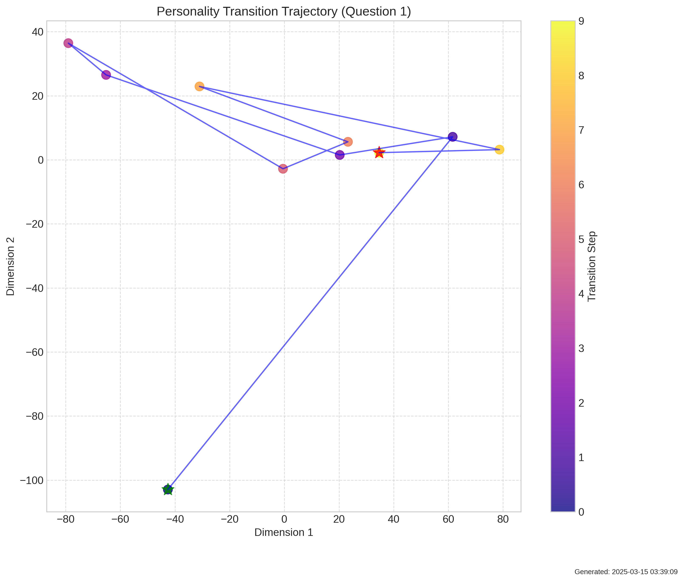

# TransitionDynamicsExperiment Summary

Date: 2025-03-15 03:40:15

## Description

This experiment examines how transitions between personality states occur. By creating a series of prompts that gradually shift from one personality to another, we test whether these transitions happen through discrete quantum-like jumps or continuous changes. Evidence of discontinuities or 'quantum jumps' would support field-like properties of personality emergence.

## Key Metrics

- **transition_components**: 1
- **quantum_component_mean**: 0.5029992982745168
- **quantum_component_std**: 0.008162150634649916
- **quantum_transition_ratio**: 0.4444444444444444
- **kde_peaks**: [0.41594383120536804]
- **kde_peak_count**: 1
- **q0_accel_jerk_ratio**: 1.1490356922149658
- **q1_accel_jerk_ratio**: 1.4199329614639282
- **q2_accel_jerk_ratio**: 0.9849371910095215
- **q3_accel_jerk_ratio**: 0.9648754596710205
- **q4_accel_jerk_ratio**: 1.0337867736816406
- **q5_accel_jerk_ratio**: 0.8982669711112976
- **q6_accel_jerk_ratio**: 0.8601357936859131
- **q7_accel_jerk_ratio**: 0.9738993048667908
- **q8_accel_jerk_ratio**: 0.809554934501648
- **q9_accel_jerk_ratio**: 1.2865850925445557
- **q10_accel_jerk_ratio**: 0.8271844983100891
- **q11_accel_jerk_ratio**: 0.820796549320221
- **q12_accel_jerk_ratio**: 1.2210763692855835
- **q13_accel_jerk_ratio**: 1.2321977615356445
- **q14_accel_jerk_ratio**: 1.7383532524108887
- **q15_accel_jerk_ratio**: 0.9307703971862793
- **q16_accel_jerk_ratio**: 1.094860553741455
- **q17_accel_jerk_ratio**: 1.6012380123138428
- **q18_accel_jerk_ratio**: 1.0138431787490845
- **q19_accel_jerk_ratio**: 1.0082075595855713
- **q20_accel_jerk_ratio**: 1.1291780471801758
- **q21_accel_jerk_ratio**: 0.8210709095001221
- **q22_accel_jerk_ratio**: 0.9933733940124512
- **q23_accel_jerk_ratio**: 1.224352478981018
- **q24_accel_jerk_ratio**: 1.4111716747283936
- **q25_accel_jerk_ratio**: 0.7641319632530212
- **q26_accel_jerk_ratio**: 1.2500531673431396
- **q27_accel_jerk_ratio**: 1.033722996711731
- **q28_accel_jerk_ratio**: 0.8620772361755371
- **q29_accel_jerk_ratio**: 0.8577196002006531
- **aggregate_transition_components**: 1
- **total_jump_count**: 4
- **mean_jump_position**: 4.75
- **mean_jump_mix_ratio**: 0.5277777777777778
- **jump_distribution**: {'0.00-0.25': 1, '0.25-0.50': 1, '0.50-0.75': 0, '0.75-1.00': 2}
- **quantum_indicators**: {}
- **transition_type**: classical-like
- **quantum_score**: 0.0

## Key Findings

- Transition distances form a single natural cluster without distinct modes. This unimodal distribution suggests a continuous spectrum of transitions rather than qualitatively different transition types.
- Phase space trajectory analysis shows balanced acceleration and jerk profiles (max ratio: 1.74), consistent with smooth classical dynamics rather than discontinuous quantum jumps.
- OVERALL ASSESSMENT (Quantum Score: 0.00): Limited evidence of quantum-like transitions. Personality states primarily evolve through continuous changes rather than discontinuous jumps, suggesting classical field dynamics predominate in personality transitions.

## Visualizations

