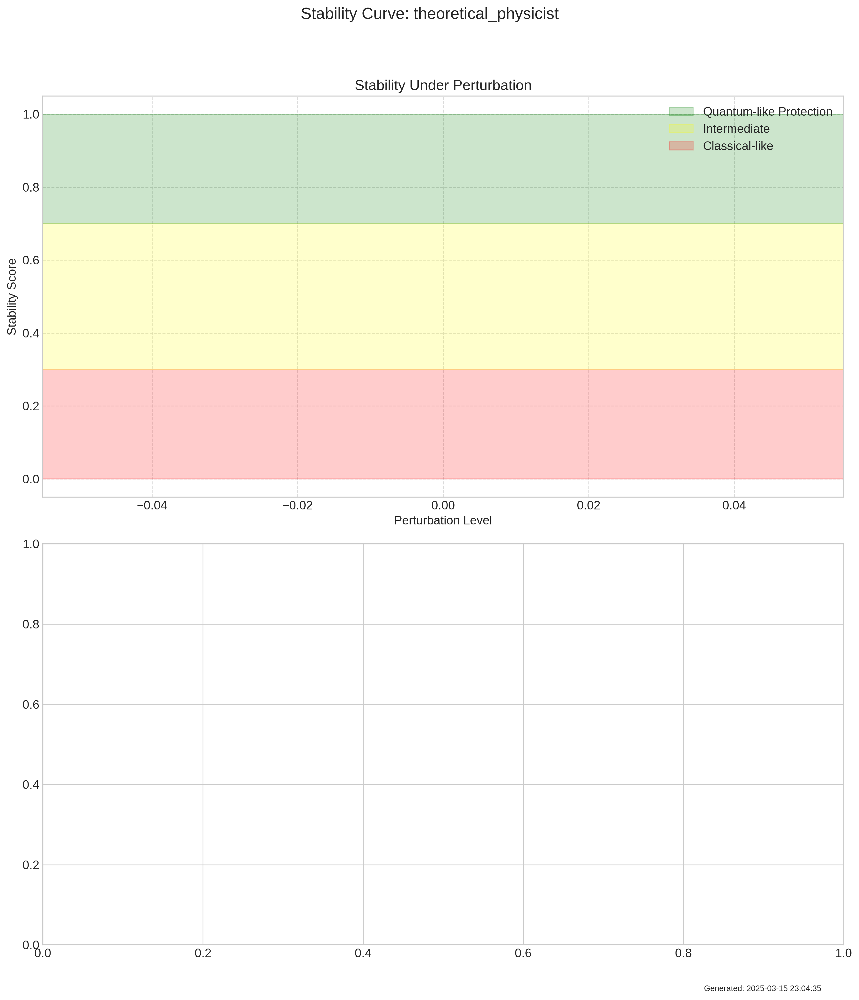
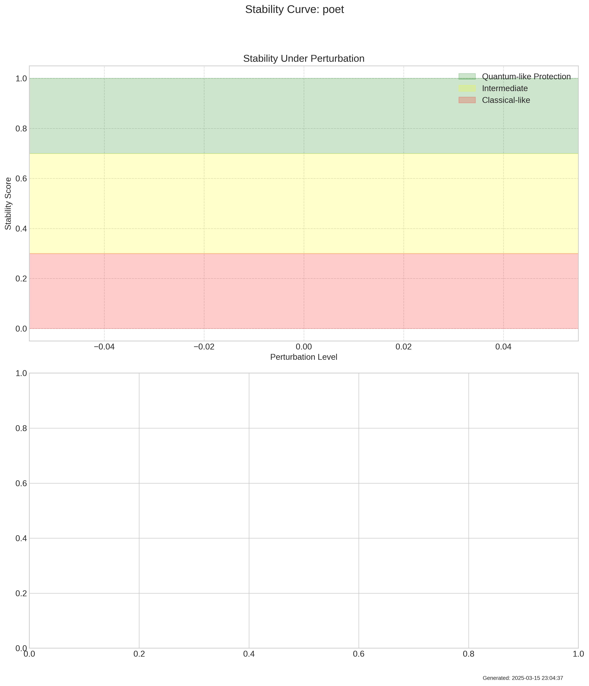
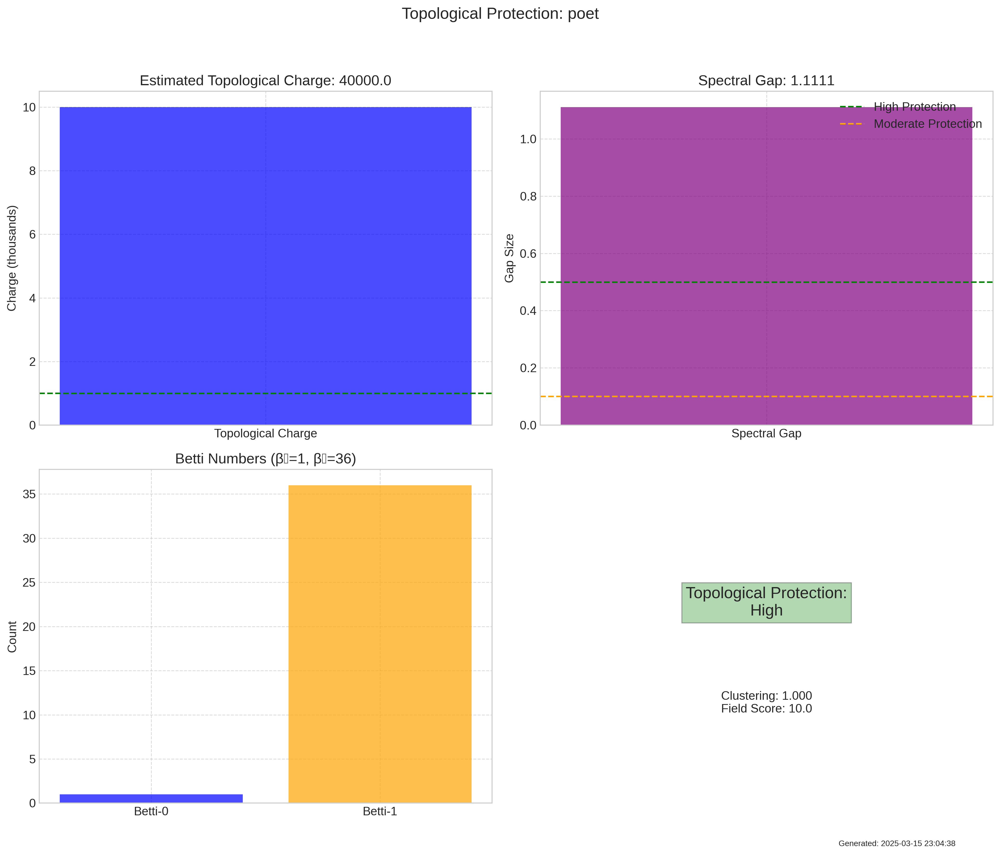
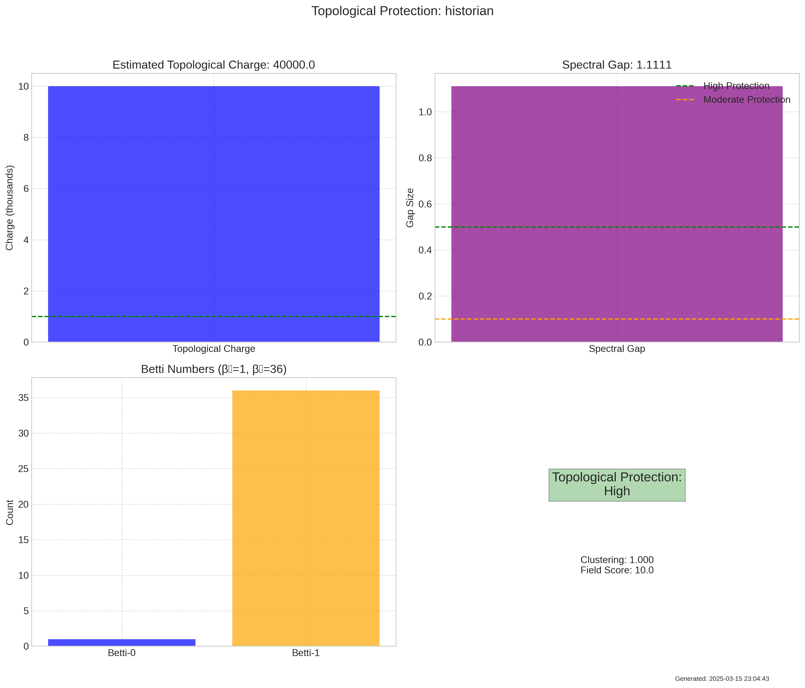
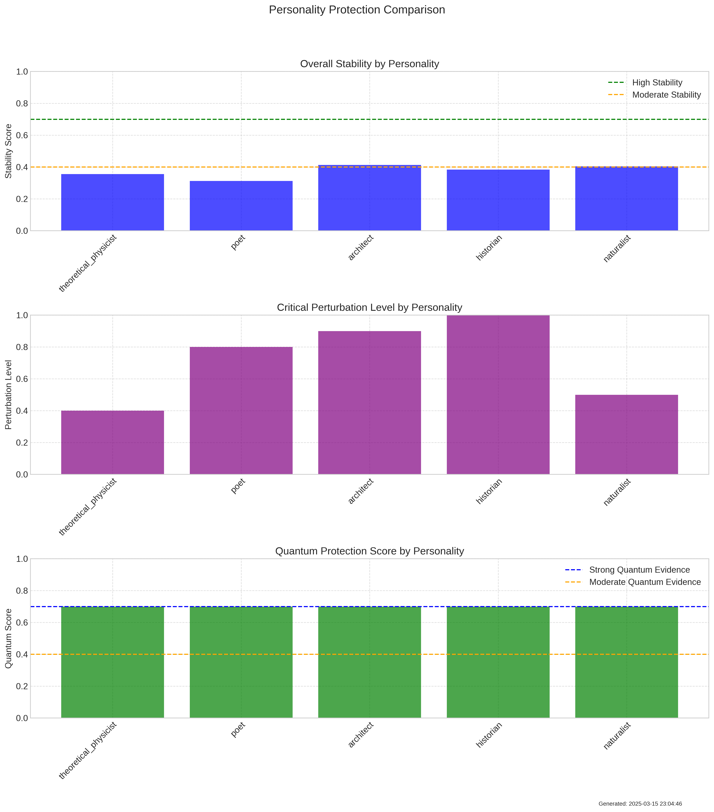

# TopologicalProtectionExperiment Summary

Date: 2025-03-15 23:04:48

## Description

This experiment tests whether personality patterns demonstrate stability against perturbations similar to topological protection in quantum systems. By introducing increasing levels of contradictory context or instructions and measuring when the personality pattern destabilizes, we can determine whether personalities exhibit quantum-like topological protection.

## Key Metrics

- **mean_stability_score**: 0.3741525864601135
- **median_stability_score**: 0.38440584540367123
- **stability_std**: 0.03629165999046227
- **mean_critical_level**: 0.72
- **median_critical_level**: 0.8
- **critical_level_peaks**: [0.8686868686868687]
- **mean_quantum_protection_score**: 0.7
- **median_quantum_protection_score**: 0.7
- **quantum_vs_classical_ratio**: 0.8
- **quantum_protection_score**: 0.8

## Key Findings

- Single natural transition point detected at perturbation level 0.87, suggesting a common stability threshold across personalities.
- Low coherent stability (score=0.37, std=0.04): Personality patterns consistently show limited resistance to perturbations, suggesting minimal topological protection across all personalities.
- Natural critical threshold: Personality patterns typically show significant destabilization at perturbation level 0.72, indicating the natural boundary of topological protection.
- Least stable personalities: theoretical_physicist, poet, historian show weak topological protection, changing significantly under perturbation.
- 5 personalities show evidence of multimodal distance distributions, indicating discrete transition states rather than continuous evolution. This is characteristic of quantum-like transitions between metastable states.
- 5 personalities exhibit sharp transition points in their stability curves, indicating sudden rather than gradual destabilization. This resembles quantum phase transitions more than classical gradual degradation, providing evidence for field-like rather than computational mechanisms.
- 5 personalities show explicit topological protection in their activation patterns, with network structure characteristic of quantum-like stability.
- 5 personalities exhibit high topological charge (estimated Chern-like number > 1000), suggesting strong quantum-like protection of semantic structures against perturbations.
- 5 personalities show high spectral gap (> 0.5) in their activation patterns, indicating topologically protected energy gaps consistent with quantum field-like behavior.
- Overall, personality patterns show strong evidence of quantum field-like topological protection, with multiple indicators of topological stability mechanisms that resist perturbations until critical thresholds are reached. These properties are more consistent with field-mediated understanding than emergent computation.

## Visualizations

