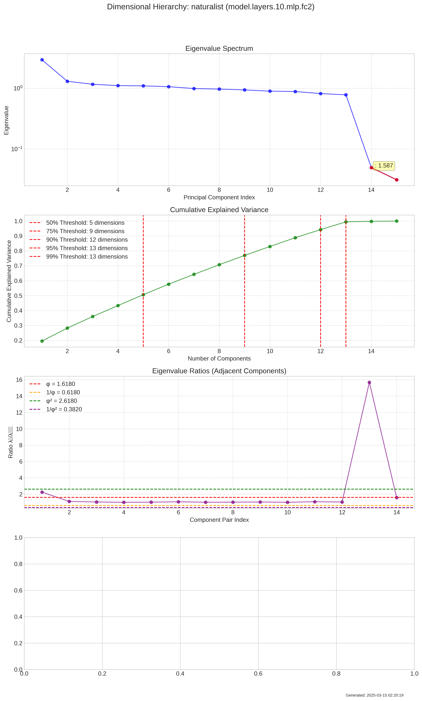

# DimensionalAnalysisExperiment Summary

Date: 2025-03-15 02:20:23

## Description

This experiment examines how personality information organizes across dimensional hierarchies. By analyzing eigenvalue distributions and compression ratios, we can identify natural dimensional organization of personality information, looking for golden ratio relationships and other mathematical patterns that would indicate quantum field-like organization.

## Key Metrics

- **global_ratio_mean**: 1.1660377979278564
- **global_ratio_median**: 1.0947537422180176
- **global_ratio_std**: 0.2099439799785614
- **global_ratio_peaks**: [1.0758817195892334]
- **global_ratio_golden_peaks**: 0
- **ratio_gmm_components**: 3
- **ratio_gmm_means**: [1.0777933988151058, 1.7601977379310882, 1.2409278741034588]
- **ratio_gmm_weights**: [0.7235190169436562, 0.08307997771054063, 0.19340100534580326]
- **natural_compression_ratio**: 0.7898802978806845
- **natural_compression_gr_name**: φ-1
- **natural_compression_gr_value**: 0.6180339887498949
- **natural_compression_gr_deviation**: 0.2780531690148389
- **mean_golden_ratio_patterns**: 0.1625
- **max_golden_ratio_patterns**: 4
- **quantum_organization_score**: 0.2
- **quantum_organization_indicators**: [0, 0, 0, 1, 0, 0]

## Key Findings

- Discovered 3 natural clusters in the eigenvalue ratio distribution with centers at 1.078 (weight: 0.72), 1.760 (weight: 0.08), 1.241 (weight: 0.19). This multi-modal distribution suggests the presence of distinct organizing principles in dimensional compression rather than random statistical patterns.
- Moderate golden ratio organization: Found an average of 0.2 golden ratio patterns per layer, with up to 4 patterns in a single layer. This provides evidence of natural mathematical organization of personality dimensions.
- OVERALL ASSESSMENT (Score: 0.20): Personality activations show limited evidence of quantum field-like dimensional organization, with dimensional properties more consistent with statistical patterns than natural mathematical organization.

## Visualizations

