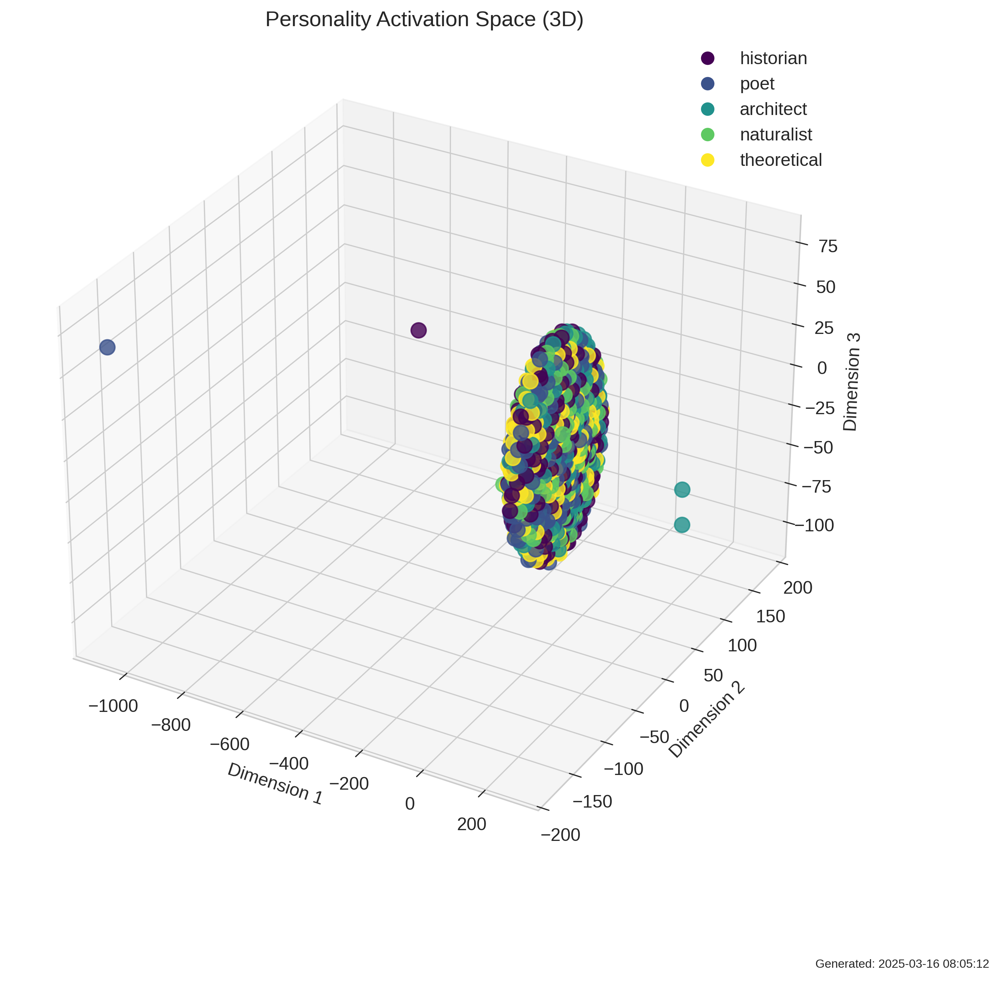
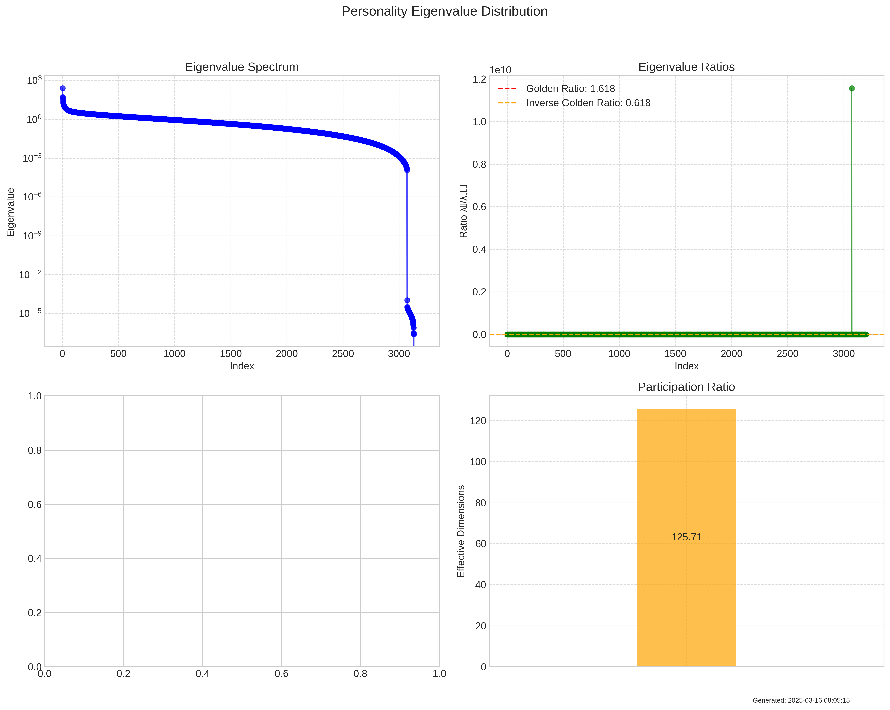

# PersonalityMappingExperiment Summary

Date: 2025-03-16 08:05:17

## Description

This experiment maps personality states in the model's activation space to determine whether they form distinct field-like patterns. By analyzing how different personalities cluster and organize in the activation space, we can test whether personality emergence exhibits quantum field-like properties.

## Key Metrics

- **optimal_n_clusters**: 222
- **expected_n_clusters**: 5
- **cluster_purity**: 0.31
- **expected_random_purity**: 0.2
- **normalized_purity**: 0.13749999999999998
- **silhouette_score**: -0.24100475013256073
- **mean_cluster_distance**: 52.40849121187612
- **optimal_clustering_method**: phase_based_affinity_propagation
- **field_phase_coherence**: 0.0803226861116507
- **field_correlation_length**: 1
- **field_eigenvalue_max**: 257.0325955572822
- **field_eigenvalue_min**: -3.194660374663126e-15
- **field_eigenvalue_ratio**: 2570325955572.822
- **field_effective_dimensions**: 125
- **golden_ratio_pattern_count**: 0
- **dimensional_compression_steps**: 0
- **quantum_field_score**: 285.36181567591416
- **topological_protection**: low
- **estimated_topological_charge**: 285355.2181724884
- **betti_0**: 1
- **betti_1**: 43252
- **spectral_gap**: 0.009563611438113337
- **clustering_coefficient**: 0.6898548177629218
- **qf_indicators**: [0.17187499999999997, 0.0, 1.0, 0]
- **qf_weights**: [0.3, 0.2, 0.3, 0.2]
- **qf_weighted_score**: 0.3515625

## Key Findings

- Natural clustering found 222 distinct states (vs 5 expected), suggesting sub-personalities or contextual variations within personality fields.
- Weak personality clustering (normalized purity=0.14): Personalities show significant overlap in activation space, suggesting more shared than distinct patterns. This is only 0.3× better than chance.
- No golden ratio patterns detected in eigenvalue distribution. Personality dimensions do not show evidence of organization based on this fundamental constant.
- High quantum field score (285.36): Personality patterns exhibit quantum-like stability properties similar to topologically protected states.
- Low phase coherence (0.08, normalized: 0.00): Personality states exhibit limited quantum-like coherence, close to what would be expected from random patterns.
- Overall quantum field score: 0.35/1.0 - Personality patterns show limited evidence of quantum field-like properties, behaving more like emergent patterns than coherent quantum fields.

## Visualizations

