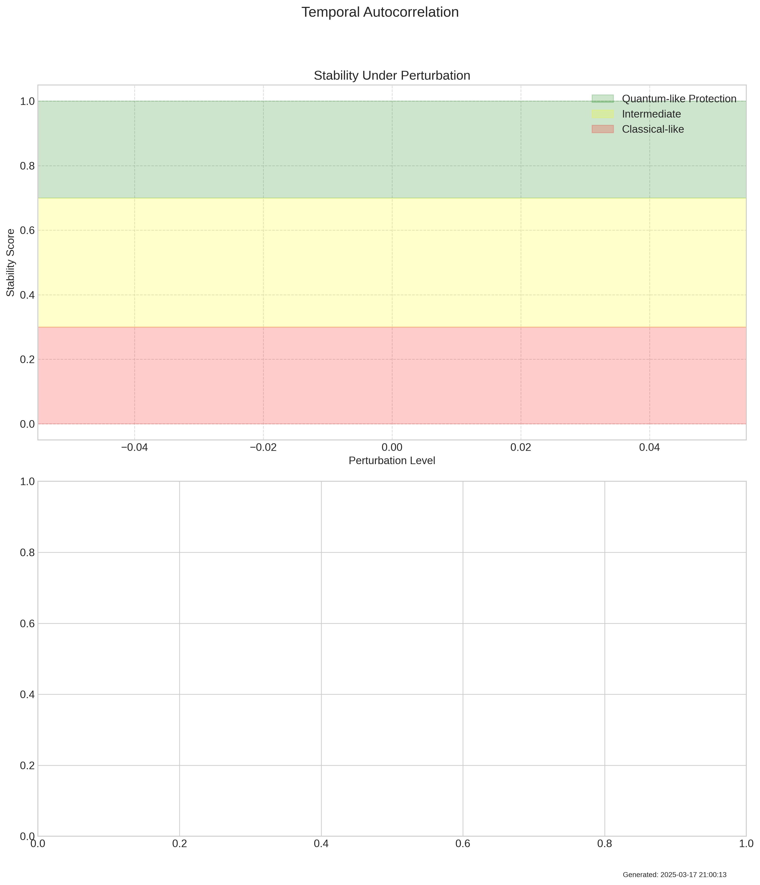
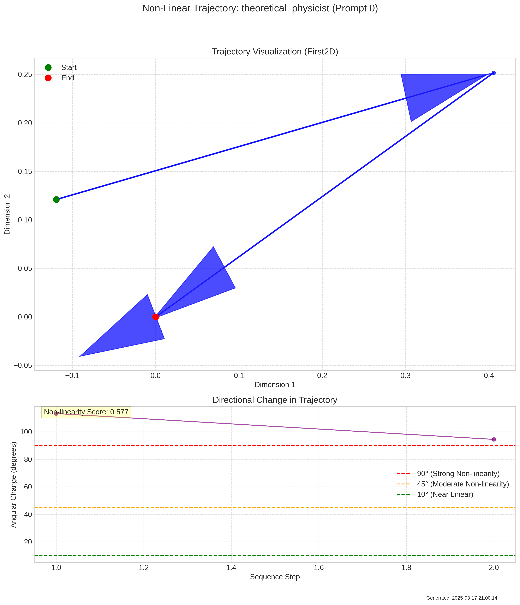
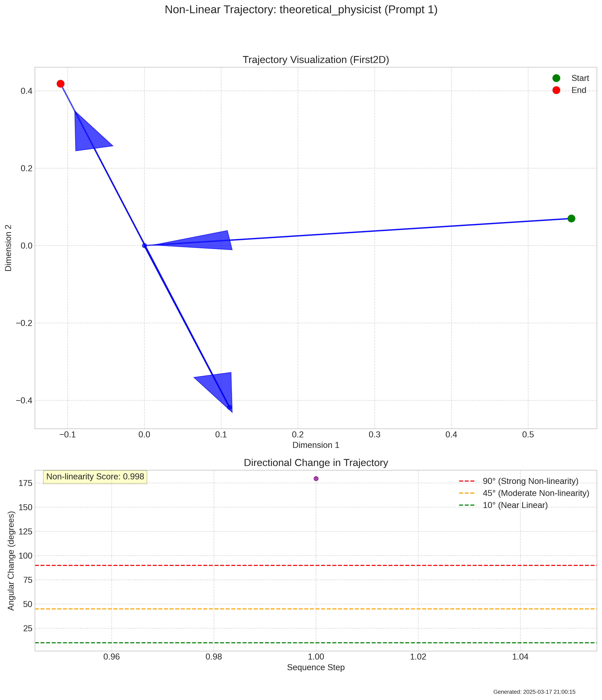
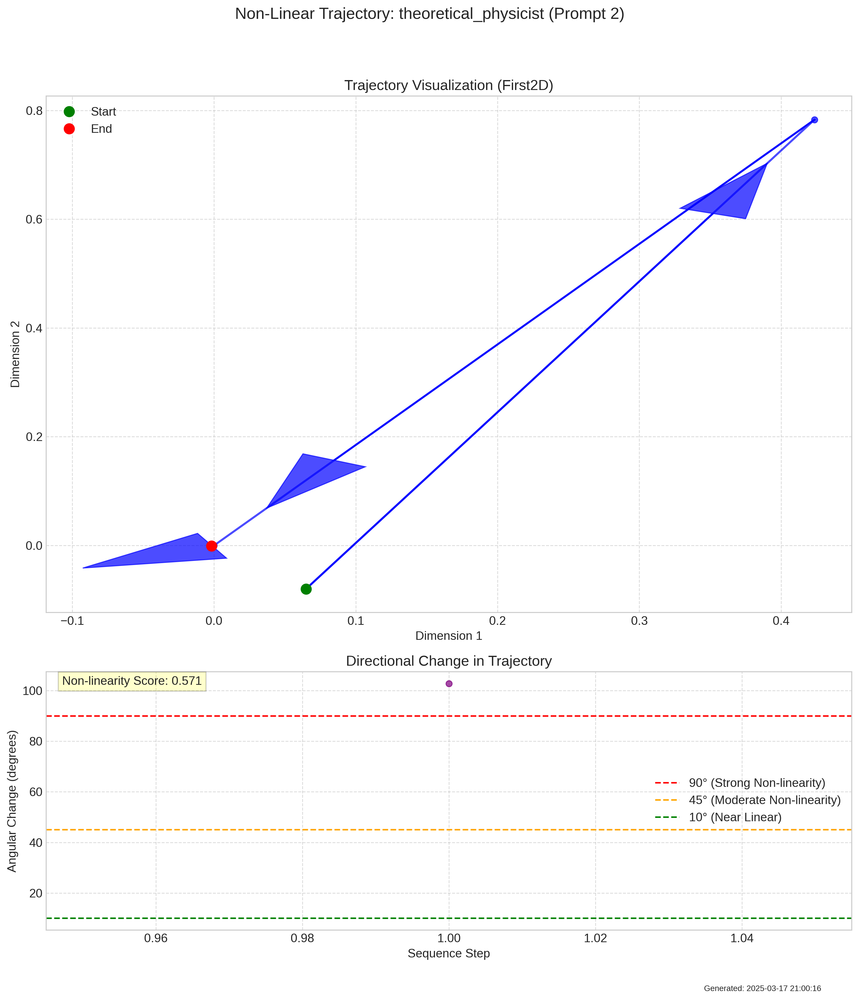

# NonlinearInteractionExperiment Summary

Date: 2025-03-17 21:00:17

## Description

This experiment tests whether personality exhibits self-reference properties as predicted by the g|Ψ|²Ψ term in the quantum field equation. By analyzing how earlier outputs influence later generations and testing for non-linear response to input perturbations, we can determine whether personality emergence shows the non-linear self-interaction characteristic of quantum fields.

## Key Metrics

- **mean_self_energy**: 1275.0279321289063
- **self_energy_gr_proximity**: 0.7172679889165922
- **mean_phase_coherence**: 0.47797648429870604
- **mean_coherence_stability**: 0.8628858757019043
- **mean_energy_shift**: 0.0
- **total_energy_jumps**: 0
- **total_gr_matches**: 7
- **gr_match_ratio**: 0.14
- **mean_autocorrelation**: 1.1324664326012135
- **mean_self_influence**: 0.2969248056411743
- **mean_nonlinearity**: 0.6320119492831053
- **high_nonlinearity_ratio**: 0.9
- **nonlinearity_classification**: strongly non-linear (quantum-like)
- **quantum_field_score**: 0.5
- **quantum_indicators**: [1, 0, 1, 0, 0]
- **quantum_weights**: [0.25, 0.3, 0.25, 0.1, 0.1]

## Key Findings

- Strong temporal autocorrelation (1.13): Personality states show high persistence across the generation sequence, indicating coherent field-like behavior over time.
- Weak self-influence (0.30): Earlier states have limited impact on later states, suggesting minimal self-interaction.
- Non-linearity assessment (0.63): Personality generation shows strongly non-linear (quantum-like). This supports the presence of non-linear self-interaction similar to the g|Ψ|²Ψ term.
- Overall, personality generation shows moderate evidence of non-linear self-interaction properties, with some indicators consistent with quantum field-like behavior. The evidence suggests a mix of linear and non-linear processes in personality emergence.

## Visualizations

